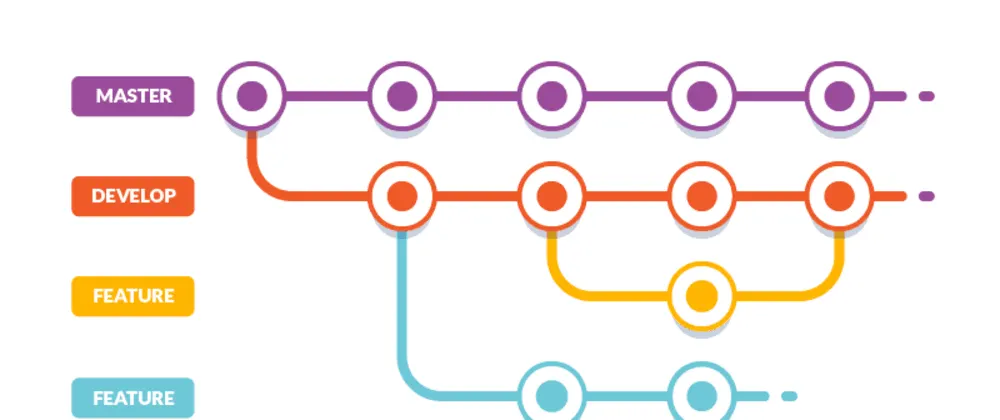
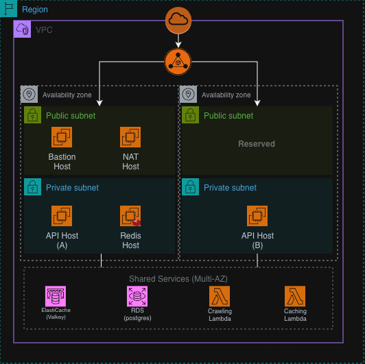

## UMC DONAKAWA Backend

## 📄 Description


**도나카와(Donakawa)는 사용자의 소비 데이터를 기반으로 더 나은 구매 결정을 돕는 AI 소비 관리 플랫폼입니다.**  
<br>
사용자는 관심 상품을 위시리스트에 저장하고, 자신의 소비 이력과 패턴을 한눈에 관리할 수 있습니다.  
특히 AI 상담 기능을 통해 “이 상품을 지금 사는 게 좋을지”와 같은 질문을 할 수 있으며,  
서비스는 축적된 사용자 소비 데이터와 상품 정보를 바탕으로 구매 의사결정을 보조합니다.

백엔드는 비동기 상품 정보 수집, 이벤트 기반 처리, 캐시 시스템을 활용해 데이터를 안정적으로 관리하며,  
가격 변동 기록 기능은 이러한 소비 분석을 돕는 보조 데이터로 활용됩니다.

**본 레포지토리는 Donakawa 서비스의 백엔드 서버로, Node.js 기반으로 핵심 비즈니스 로직과 RESTful API를 제공합니다.**

## 👨‍💻 Developers

|  |  |  |  |  |
| :------------------------------------------------------------------------: | :-------------------------------------------------------------------------: | :-------------------------------------------------------------------------: | :------------------------------------------------------------------------: | :-------------------------------------------------------------------------: |
|                   [이호현](https://github.com/hoshi2710)                   |                     [유채원](https://github.com/cochae)                     |                    [최혜원](https://github.com/gpdnjs8)                     |                   [김가윤](https://github.com/JCTA0125)                    |                    [박태경](https://github.com/tgyeongt)                    |

## 📁 Project Structure

```
donakawa-BE
├── assets/                  # 아키텍처 이미지 등 정적 리소스
│
├── infra/                   # 로컬 개발용 인프라 설정
│   ├── postgres/            # PostgreSQL 도커 설정
│   └── redis/               # Redis 도커 설정
│
├── src (dist 기준 정리)     # ✨ 메인 백엔드 애플리케이션
│
│   ├── auth/                # 🔐 인증 / 인가 (로그인, JWT, OAuth)
│   │   ├── controller/
│   │   ├── service/
│   │   ├── repository/
│   │   ├── dto/
│   │   └── middleware/
│
│   ├── chats/               # 💬 AI 채팅 기능 (GPT 연동)
│   │   ├── controller/
│   │   ├── service/
│   │   ├── repository/
│   │   └── dto/
│
│   ├── wishlist/            # ⭐ 위시리스트 핵심 도메인
│   │   ├── controller/
│   │   ├── service/
│   │   ├── repository/
│   │   ├── command/         # 비동기 작업 명령 (크롤링 등)
│   │   ├── payload/         # 이벤트/메시지 구조 정의
│   │   ├── infra/           # SQS, 메타데이터, 이벤트 클라이언트
│   │   ├── policy/          # 업로드 및 도메인 정책
│   │   └── dto/
│
│   ├── files/               # 📁 파일 업로드 (S3 연동)
│   │   ├── service/
│   │   ├── repository/
│   │   ├── storage/         # 스토리지 추상화 (S3 구현체)
│   │   └── command/
│
│   ├── goals/               # 🎯 목표 및 예산 계산 도메인
│   │   ├── controller/
│   │   ├── service/
│   │   ├── repository/
│   │   └── dto/
│
│   ├── histories/           # 📜 사용자 활동 기록
│   │   ├── controller/
│   │   ├── service/
│   │   ├── repository/
│   │   └── dto/
│
│   ├── internal/            # 🛠 내부 전용 API (시스템 연동용)
│   │   ├── controller/
│   │   └── service/
│
│   ├── common/              # 공통 응답 포맷 및 유틸
│   ├── errors/              # 글로벌 에러 정의
│   ├── middleware/          # 공통 미들웨어 (validation 등)
│   ├── infra/               # DB, Redis, Valkey 연결 계층
│   ├── enum/                # 전역 enum 정의
│   ├── types/               # 전역 타입 정의
│   └── tsoa/                # Swagger 및 라우팅 자동 생성
│
├── ecosystem.config.js      # PM2 배포 설정
├── swagger.json             # API 문서 스펙
└── package.json             # 프로젝트 정보 및 의존성
```

## 🌿 Branch Strategy



- **Main** : 완료된 버전
- **Develop** : 개발 중인 버전
- **Feature** : 각 기능별 브랜치 **(feature/{nickname}/{feature_name})**

## 📚 Tech Stack

- Node.js
- Express.js
- TypeScript
- Tsoa
- PostgreSQL
- Redis / Valkey
- Prisma ORM
- JWT
- Swagger

## 🎯 Git Convention

🎉 **Start**: 새로운 프로젝트 시작 `[:tada:]`

✨ **Feat**: 새로운 기능을 추가 `[:sparkles:]`

🐛 **Fix**: 버그 수정 `[:bug:]`

🎨 **Design**: CSS 등 사용자 UI 디자인 변경 `[:art:]`

♻️ **Refactor**: 코드 리팩토링 `[:recycle:]`

🔧 **Settings**: 설정 파일 수정 `[:wrench:]`

🗃️ **Comment**: 필요한 주석 추가 및 변경 `[:card_file_box:]`

➕ **Dependency/Plugin**: 의존성 / 플러그인 추가 `[:heavy_plus_sign:]`

📝 **Docs**: 문서 수정 `[:memo:]`

🔀 **Merge**: 브랜치 머지 `[:twisted_rightwards_arrows:]`

🚀 **Deploy**: 코드 배포 `[:rocket:]`

🚚 **Rename**: 파일 혹은 폴더명을 수정하거나 옮기는 작업만인 경우 `[:truck:]`

🔥 **Remove**: 파일을 삭제하는 작업만 수행한 경우 `[:fire:]`

⏪️ **Revert**: 전 버전으로 롤백 `[:rewind:]`

## 🏗️ Server Architecture


